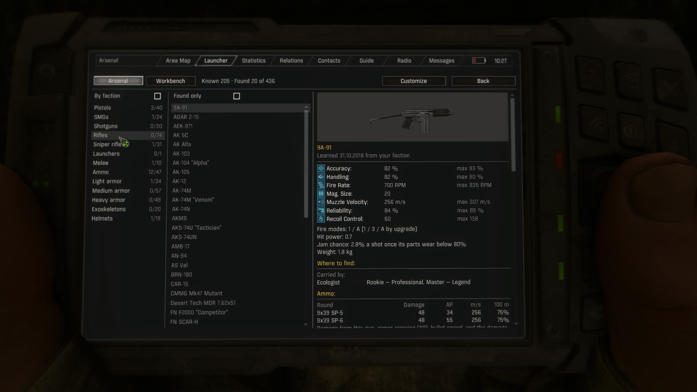
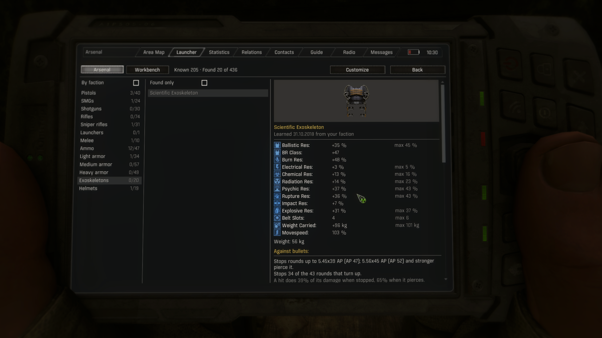
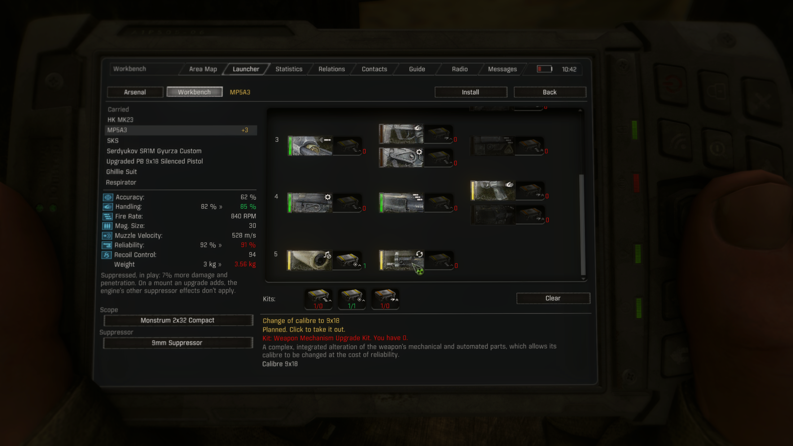

# Arsenal

**Every gun, round, suit and helmet in your GAMMA game, in the PDA: its stats, where to find
it, what fits it, and which ones you have found. You learn of them as you play. Its
Workbench page plans upgrades on GAMMA's own upgrade trees and hands them to your toolkit.**

Arsenal is a PDA app for the S.T.A.L.K.E.R. Anomaly modpack GAMMA. It reads the running
game's own configs, so the catalog is whatever your mod list has, with the numbers your
inventory shows. What never turns up in your game, short of console commands, is not in it.
Browse it by category, or tick **By faction** to see what each faction's fighters carry and
wear.

## You learn as you play

Arsenal starts out knowing what your faction knows: the gear its fighters carry and wear,
and what its new-game kit offers. The rest you learn in the Zone:

- **Fights.** A fighter you kill shows you his gun and suit, and who carries them. Every ten
  kills of a faction bring word of more of its gear; after twenty-five, you know its gear
  inside out.
- **Looking.** A body, a stash or a trader's stock teaches you what is in it, and where.
- **PDAs.** A PDA you pick up is a data package: its owner's word on his own faction's gear,
  or on a faction his is allied with or at war with, as the game's relations stand, up to his
  rank. Neutral factions know little of each other. An encrypted PDA keeps its secrets until
  a technician decrypts it; a rare one carries full specs.
- **Talking.** Anyone willing will pass on one thing a day that his faction, an ally or an
  enemy carries, up to his own rank; experts, masters and legends know its specs.
  Technicians and traders know of special guns, the ones no ordinary fighter carries, and
  will tell you what one is and how to get it, for a price.

A gun or suit shows its stats and what fits it once you have studied it: found one, or had
its specs from someone who knows. A round is known once you know a gun that fires it. New entries come with a PDA message and glow in the list
until you click them, like unread mail, and so does anything you find for the first time.
Arsenal's tile in MAC's launcher shows how many are waiting.

**MCM > Arsenal > Jailbreak** opens everything, like a finished encyclopedia. While it is on, a
lit padlock in the footer of both pages says so, screenshots included.

## What a page shows

- **The stat card** from the inventory, and the most each stat reaches fully upgraded, with a
  gun's hit power and how often it jams once its parts wear. For suits and helmets, the armor
  card GAMMA's inventory shows, value for value.
- **Against bullets,** for suits and helmets: the strongest round each stops and the weakest
  that pierces it, how many of the game's rounds it stops, and how much of a hit gets through
  either way, worked out as GAMMA's damage balancer does.
- **Variants.** Items that share a name are one entry. Versions that play differently are
  listed by what sets them apart, each with when and where you found it.
- **Where to find it.** The factions whose fighters carry or wear it and at which ranks,
  likeliest first, and how often a suit drops; the levels where one stash most likely holds
  it, with the chance (rare stashes too); traders by supply tier, with what unlocks the tier
  (goodwill, Heavy Pockets, a mechanic's toolkits); bodies; story characters; tasks and story
  rewards; crafting; Homestead's stash runs; the Armor Exchange; Nimble's trade-ins; the gun
  and kit it is made from; new-game kits.
- **Ammo,** as a table: each round's damage from this gun, armor piercing, bullet speed and
  the damage left at 100 m; then the calibers a conversion upgrade opens. Rounds have pages of
  their own: damage, armor piercing, speed, pellets, falloff, and the guns that fire them.
  With ArtiGrok Ballistics, its anomalous rounds are listed too, and a round's page adds its
  special effects and its damage against mutants, pseudogiants and stalkers; armor piercing
  and falloff follow ArtiGrok's.
- **Magazines,** when Mags Redux is on.
- **Scopes, suppressors and accessories:** launchers with their grenades, laser modules,
  kits, and mounts an upgrade adds.
- **Camos** from 3DSS's camo system: the ones you have discovered, and which factions' guns
  carry the rest.
- **Parts,** and the **repair kits** that fit it.
- **R.I.S.K. enhancements,** when Neffi's Randomized Item Stat Kits is installed: what each kind
  of enhancement does to this gun's stats, weakest to strongest, and the worst bad roll.

In English and Russian.

## Workbench

Arsenal's second page; the switch at the top left of both pages moves between them, and
**Customize** on a gun, suit or helmet opens Workbench on it.

- **GAMMA's upgrade tree,** drawn as the toolkit's Upgrade tab draws it, with the kit each
  upgrade takes and how many of that kit you have. Click an upgrade to plan it: what it needs
  first comes along, and the other of a pair makes way. Installed upgrades are green, planned
  ones yellow, shut ones dark.
- **The stat card, now and planned,** worked out the way the inventory card does it, down to
  the engine's float32 rounding, with the planned value green where it is better and red
  where it is worse.
- **The kits** the plan takes, against what you have with you (and, with Craft From Stashes,
  in stashes nearby).
- **Attachments:** the scopes, suppressor and launcher a gun takes with the plan, with their
  weight on the card and what a suppressor does in play.
- **Install** closes the PDA and opens your toolkit on the item with the plan checked. Upgrade
  there puts the upgrades in and spends the kits, as it always does: the toolkit's rules and
  costs stay GAMMA's. It needs a toolkit with you (or in a stash nearby) and the item in your
  inventory. The one upgrade the engine refuses in a single visit (the Kiparis' fourth row,
  which needs the fifth row's first) is marked red and goes in on a second.

Items you carry are listed with their plans; models customized from the catalog stay listed
for planning. Plans are kept in your save.

## Collecting

An item counts as found the first time it enters your inventory: picked up, looted, bought,
crafted or given as a reward. Whatever you carry when a save loads counts too, so a
playthrough already underway starts with credit. The PDA counts found models by category
out of what turns up in your game, and a filter shows only those.

Items you only see do not count as found, unless you turn on **MCM > Arsenal > Count guns you
see**.

## PDA messages

Arsenal tells your PDA when you find or learn of something for its catalog. **Silence**, at the
foot of both pages, turns those messages off and on again; it is **MCM > Arsenal > PDA
notifications**, seen on the page. The foot also names the version you run and its author, so a
screenshot of Arsenal shows which one it is.

## What never turns up

Arsenal leaves out what your game never gives you: guns no fighter, stash, trader, story
character, task, gift, recipe or trade-in provides, and kits nothing provides (GAMMA has a
number of these). The Wish Granter's riches wish, which hands out nearly every item at the end
of the story, does not count. With the jailbreak they are listed, darker, marked as never
turning up, and left out of the counts.

## Requirements

- GAMMA. Arsenal reads GAMMA's loadouts, stashes, traders, drop tables, repair kits and camos
  where a mod list has them, and leaves out what it lacks.
- [Mod App Creator (MAC)](https://www.moddb.com/mods/stalker-anomaly/addons/mod-app-creator-mac)
  for the PDA tile. Without it, open Arsenal with the key below.
- MCM, which GAMMA includes; Modded Exes' DXML, which GAMMA includes, for the talks.

## Install

In Mod Organizer 2, use **Install a new mod from archive**, pick the zip, and enable the mod.
Arsenal shares no file with any other mod, so its place in the load order does not matter.
It works in a new game or an existing one.

## Works with

- **Fatal Error:** Arsenal and Workbench keep the PDA's tab bar on every PDA model, and the key
  below opens Arsenal only while the PDA works.
- **ArtiGrok Ballistics** and **Leekos Munition Merge:** the anomalous rounds are listed, with
  their effects.

## Sharper pages with the 3D PDA

With the 3D PDA on, the game draws PDA pages onto the screen of the PDA in your hands, which
softens small text and icons. **MCM > Arsenal > Open Arsenal on its own** takes a key that
opens Arsenal straight on the screen, as sharp as the inventory; the switch takes it to
Workbench there too.

## Credits

- The [GAMMA Item Database](https://stalker-gamma-db.com/) by simonwdev and SaloEater, the
  reference for what a weapon page should cover. Arsenal reads the game itself rather than
  their data, as SaloEater suggested, so any mod list gets a true catalog.
- Mod App Creator by Denis_3edd.
- The GAMMA mods whose data Arsenal reads: Weighted NPC Random Loadouts, Grok's stash
  overhaul, Darkasleif's Nimble Upgrades Guns, Weapon Parts Overhaul, 3DSS for GAMMA's camo
  system, Accurate Defense Values and the Actor Damage Balancer, Outfit Drop Chance, Grok's
  and Darkasleif's Armor Exchange, Dux's Innumerable Characters Kit.
- [R.I.S.K.](https://www.moddb.com/mods/stalker-anomaly/addons/risk-randomized-item-stat-kits-for-gamma)
  by Neffi. Arsenal reads its enhancements from the running game and ships none of its files.
- [ArtiGrok Ballistics](https://github.com/ilrathCXV/ArtiGrok-Ballistics-GAMMA-ilrath-Mo3) by
  ilrathCXV, and [Leekos Munition Merge](https://github.com/Leekos/Leekos-Munition-Merge) by
  Leekos: Arsenal asks ArtiGrok's own scripts for its rounds' effects, armor piercing and
  falloff, reads both mods' recipes as crafting, and ships none of their files.
- [Fatal Error](https://www.moddb.com/mods/stalker-anomaly/addons/fatal-error-by-ncenka) by
  Ncenka: Arsenal reads its PDA state and ships none of its files.

## Development

`tools/` builds and tests the mod. `build.py` runs the tests and installs into an MO2 mod
folder; `test_*.py` run the scripts under LuaJIT (lupa) against stand-ins for the engine,
each with mutants the tests must catch; `release.py` packages the zip. Who wears which suit,
which story characters carry what, and which trade configs NPCs use come from files a script
cannot read while the game runs; `census.py` reads them from the install (through
`gamecfg.py`, Mod Organizer 2's file system and the DLTX loader) and writes
`gamedata/configs/plugins/arsenal_census.ltx`. Run it after GAMMA changes its character files.

## License

MIT; see [LICENSE](LICENSE).
